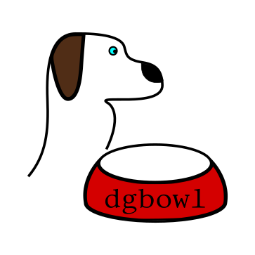
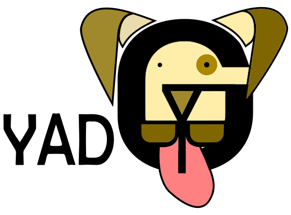

    

        

            
        

        

            <h2>: tools for digital (electro-)catalysis</h2>
        

        

    

    

         
         
         
         
    

    

         
         
         
         
    

    

         
         
         
         
    

    

        

        

            Developed at ,
            <a href="https://www.empa.ch/web/s501">Lab 501: Materials for Energy Conversion</a> 
            © 2021-2022
        

    

