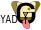

    
<h1>dgbowl: tools for digital (electro-)catalysis</h1>

    

        
        
        
        
    

    

        
        
        
        
    

    

        
        
        
        
    

    

© 2021-2022

